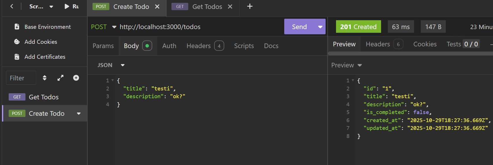

# Hono + React RPC Example

Check: https://hono.dev/examples/grouping-routes-rpc

## Docker example, todo-API

API
- GET `/health` - healthcheck
- GET `/todos` - list todos
- POST `/todos` - create todo, body: `{ "title": "string", "description": "string?" }`
- GET `/todos/:id` - fetch one
- PATCH `/todos/:id` - partial update, body can include any of: `title`, `description`, `is_completed`
- DELETE `/todos/:id` - remove todo

API can be tested for example with [Insomnia](https://insomnia.rest/):

Env
- `POSTGRES_HOST` (default `127.0.0.1`)
- `POSTGRES_PORT` (default `5432`)
- `POSTGRES_DB` (default `example`)
- `POSTGRES_USER` (default `postgres`)
- `POSTGRES_PASSWORD` (default `super_salainen_salasana`)

Docker
- `docker compose up --build`
- Backend connects to DB with `POSTGRES_HOST=db`, check: `compose.yaml`.

Adminer is for the management of the database.

AI notice:
- Codex CLI was used to generate parts of the initial code
- Current code is human checked, cleaned and verified
